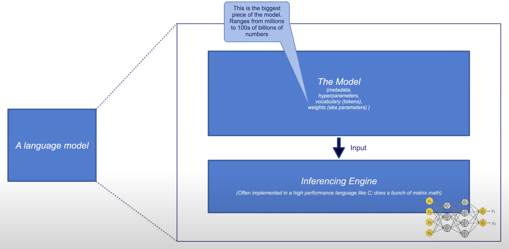

<div style="text-align: center;">
    
</div>

# Local AI Inference Tools

In this guide, we will explore two powerful tools for local inference with large language models (LLMs): **Ollama** and **Local AI**. Both tools provide a way to run models locally on your machine, offering more control and privacy compared to cloud-based solutions.

## Ollama

**Ollama** is a local inference tool that allows you to easily pull and run large language models on your local machine. With Ollama, you can connect to a wide range of LLMs and manage them efficiently. It also integrates with the OpenWeb UI for seamless interaction with models.

- Download Ollama [here](https://ollama.com/download).

### Pulling a Model

You can pull a model using the following commands:

```bash
ollama pull llama3.2
```

or

```bash
ollama pull llava
```
### Running a Model
```bash
ollama run llama3.2
```

### Running OpenWeb UI to Connect to Locally Running Ollama

Run the following command to start OpenWeb UI and connect it to your locally running Ollama instance:

```bash
docker run -d -p 3000:8080 --add-host=host.docker.internal:host-gateway -v open-webui:/app/backend/data --name open-webui --restart always ghcr.io/open-webui/open-webui:main
```

---

## Local AI

**Local AI** is a lightweight, fast, and secure AI inference service that can run anywhere. It provides a robust environment for deploying and running language models locally. This solution is perfect for users who want control over their AI workloads and need a flexible deployment option.



| **Model**       | **Year** | **Number of Parameters** | **Size (GB)**        |
|-----------------|----------|--------------------------|----------------------|
| **GPT-2**       | 2019     | 1.5B                     | ~0.5 GB              |
| **GPT-3**       | 2020     | 175B                     | ~350 GB              |
| **GPT-3.5**     | 2022     | 175B                     | ~350 GB              |
| **GPT-4**       | 2023     | Estimated 1T - 1.8T      | ~800-1200 GB         |
| **LLaMA 2**     | 2023     | 7B / 13B / 70B           | ~4 GB / ~8 GB / ~120 GB |
| **LLaMA 3.2**   | 2024     | 1B / 3B / 90B            | ~2-600 GB          |


### Download Binary

```bash
curl -Lo local-ai "https://github.com/mudler/LocalAI/releases/download/v2.22.0/local-ai-$(uname -s)-$(uname -m)" && chmod +x local-ai
```

### Run Local AI

```bash
./local-ai
```

### Web UI

Open a browser tab and head over to [http://localhost:8080](http://localhost:8080) to check out the model gallery.

### List Models

```bash
local-ai models list
```

Or

```bash
curl http://localhost:8080/models
```

### Install Models

You can either use the web UI to install the models or the CLI:

```bash
local-ai models install llama-3.2-3b-instruct:q4_k_m
```

### With Docker Compose

```yaml
# Prepare the models into the `models` directory
mkdir models

# Copy your models to the directory
cp your-model.gguf models/

# Run the LocalAI container
docker run -p 8080:8080 -v $PWD/models:/models -ti --rm quay.io/go-skynet/local-ai:latest --models-path /models --context-size 700 --threads 4

# Expected output:
# ┌───────────────────────────────────────────────────┐
# │                   Fiber v2.42.0                   │
# │               http://127.0.0.1:8080               │
# │       (bound on host 0.0.0.0 and port 8080)       │
# │                                                   │
# │ Handlers ............. 1  Processes ........... 1 │
# │ Prefork ....... Disabled  PID ................. 1 │
# └───────────────────────────────────────────────────┘

# Test the endpoint with curl
curl http://localhost:8080/v1/completions -H "Content-Type: application/json" -d '{
     "model": "your-model.gguf",
     "prompt": "A long time ago in a galaxy far, far away",
     "temperature": 0.7
   }'
```

### Try It Out!

```bash
curl http://localhost:8080/v1/completions -H "Content-Type: application/json" -d '{
     "model": "llama-3.2-3b-instruct:q4_k_m.gguf",
     "prompt": "Hey, how are you today?",
     "temperature": 0.7
   }'
```

### An Actual Use Case: Troubleshooting K8s

#### Creating a Test Cluster with an Issue

```bash
kind create cluster
kubectl run nginx --image nginx2
```

#### Install K8sGPT

```bash
brew tap k8sgpt-ai/k8sgpt
brew install k8sgpt
```

#### Setup LocalAI as the AI Backend

```bash
k8sgpt auth add -b localai -u http://localhost:8080/v1 --model llama-3.2-3b-instruct-q4_k_m.gguf
```

#### Analyze Our Issue with Local AI

```bash
k8sgpt analyze --explain --backend localai 
```

#### Debugging with Log Level

Set the log level to debug and rerun the solution:

```bash
./local-ai --log-level=debug
```

```bash
k8sgpt analyze --explain --backend localai
```

## Resources

- [Ollama](https://ollama.com)
- [Open Web UI](https://docs.openwebui.com)
- [LocalAI](https://localai.io)
- [K8sGPT](https://k8sgpt.ai)
- [LocalAI GitHub](https://github.com/mudler/LocalAI)
- [K8sGPT GitHub](https://github.com/k8sgpt-ai)
